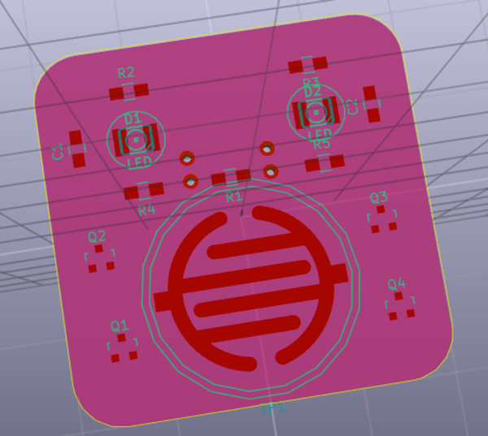

# ⨷⨷⨷⨷ WORK IN PROGRESS... ⨷⨷⨷⨷

I wanted to create a simple project to teach soldering and electronics to kids (10+ years). I first thought of a simple two transistor LED flasher, but then decided to make it interactive by adding a touch sensitive element to it. The idea is that once made, this PCB can be worn as a badge.

I had initially designed this using through-hole components. But with SMD becoming more and more common, it seems like a better choice. Plus SMD will have a much flatter profile - more suited to a badge.

I plan to test this out with my 10-year old first. If that goes well, I plan to organize a soldering workshop in my neighborhood.
